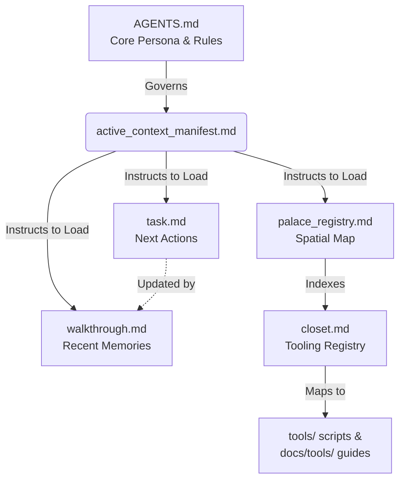

# Zero-Global Memory: The Sovereign AI Memory Architecture

> **Artifact Level:** L2 (Analysis)
> **Rule Reference:** Rule 1, Rule 8, Rule 18 — `.agents/AGENTS.md`
> **Status:** Active Baseline — foundational doctrine for all DSOM projects.

## Abstract

By enforcing Zero-Global Memory, the DSOM framework resolves the most critical structural failure in standard LLM deployments: the AI's memory is ephemeral, vendor-locked, and unauditable. With this architectural mandate, all project knowledge, operational state, and session context live exclusively in a Git repository — never inside the AI agent itself. The AI becomes a stateless, replaceable reasoning engine. The repository becomes the brain.

---

## 1. The Core Problem: Ephemeral AI Memory

Standard LLM deployments suffer from three compounding memory failures:

### 1.1 Session Wipeout
Every chat session is isolated. When a session closes, the AI loses all accumulated context: server names, IP schemes, design decisions, in-progress task states, and personal preferences. The next session starts from zero.

### 1.2 Vendor Lock-in
When project memory accumulates inside a proprietary AI tool (e.g., saved chats, project instructions stored in the vendor's cloud), migrating to a different model or provider requires re-teaching everything from scratch. The institutional knowledge is trapped.

### 1.3 No Audit Trail
There is no way to ask: *"What did the AI know on 14 July, and who told it that?"* Memory changes are invisible and unversioned. This is catastrophic for regulated or security-sensitive operational environments.

---

## 2. The DSOM Solution: Git as the Brain

Zero-Global Memory resolves all three failures by a single architectural constraint:

> **The AI is forbidden from acting as the source of truth. The Git repository is.**

Every piece of operational knowledge the AI needs must exist as a committed file in the repository before the AI can act on it. If it is not in Git, it does not exist.

```
╔══════════════════════════════════════════════════════════╗
║            ZERO-GLOBAL MEMORY ARCHITECTURE               ║
╠══════════════════════════════════════════════════════════╣
║                                                          ║
║  ❌  AI Agent (stateless — memory wiped on close)        ║
║                                                          ║
║  ✅  .agents/brain/           (Git-committed state)      ║
║       ├── task.md             current task queue         ║
║       ├── walkthrough.md      session anchor             ║
║       ├── palace_registry.md  spatial memory index       ║
║       ├── active_context_manifest.md  session scope      ║
║       └── wings/              knowledge rooms (closets)  ║
║                                                          ║
║  ✅  .agents/AGENTS.md        persona + 19 core rules    ║
║  ✅  docs/governance/         architecture + protocols   ║
║  ✅  tools/                   operational ritual scripts  ║
║                                                          ║
╚══════════════════════════════════════════════════════════╝
```

---

## 3. The Mechanics: How Memory Is Structured

### 3.1 The Sovereign Markdown Palace

Memory is not stored as a flat list of notes. It is structured into a spatial architecture — the **Sovereign Markdown Palace** — organised into hierarchical rooms:

```
.agents/brain/
├── palace_registry.md         ← master spatial index
├── active_context_manifest.md ← active session file list
├── task.md                    ← current sprint tasks
├── walkthrough.md             ← session mental anchor
├── checkpoint_summary.txt     ← hibernation state dump
└── wings/
    ├── wing_dsom_core/
    │   └── hall_facts/
    │       └── room_tooling/
    │           └── closet.md  ← specific knowledge unit
    └── wing_infrastructure/
        └── ...
```

Each `closet.md` contains a bounded, single-topic knowledge unit (OKF-compliant). The AI navigates this structure deterministically — it does not search, it reads from a declared address.

### 3.2 Active Context Manifest

The AI never loads the entire `.agents/brain/` directory. Instead, it reads only the files declared in `active_context_manifest.md` at the start of each session:

```markdown
## Active Files
- .agents/brain/task.md
- .agents/brain/walkthrough.md
- .agents/brain/palace_registry.md
- .agents/brain/wings/wing_dsom_core/hall_facts/room_tooling/closet.md

## Excluded (Archival — load via view_file with line ranges only)
# palace_update_proposal files: 30,000–55,000 tokens each
```

This is the **Progressive Disclosure** principle applied to memory: load only what is needed for the current session. The three archival `palace_update_proposal` files in the baseline repository alone contain 120,466 tokens — loading them wholesale would consume the entire context window before any work begins.

### 3.3 The Episodic Resume Protocol (Rule 18)

At the end of every significant workflow, the AI generates a `[DSOM EPISODIC RECORD]` block — a compact serialisation of the session's cognitive state. This record is saved by the human operator and used to reanimate the next session precisely where the last one ended:

```
[DSOM EPISODIC RECORD]
1. IDENTITY & CONTEXT MATRIX   → who, what project, which gem
2. THE DELTA (COGNITIVE LOCK)  → last milestone, blocking issues
3. MEMORY CORE & PARAMETERS    → rules asserted, file dependencies
4. NEXT ACTION QUEUE           → exact next steps
```

Without this record, the next session begins from zero. With it, reanimation takes seconds.

### 3.4 The Cognitive Flow Map

To fully visualize how the AI navigates this Zero-Global Memory structure during a session, the following relational matrix dictates the strict path of context ingestion:



**Relational Matrix:**
- **`AGENTS.md`**: The absolute cognitive entry point. Governs the format and behavioral constraints for every subsequent file.
- **`active_context_manifest.md`**: The Session Bootloader. Directs the AI to selectively load task, walkthrough, and spatial memory indices without flooding tokens.
- **`palace_registry.md`**: The Spatial Map. Indexes all knowledge rooms (closets), preventing the need for the AI to "search" the filesystem blindly.
- **`task.md` & `walkthrough.md`**: The short-term action queue and episodic memory anchor, functioning together to serialize the precise state of execution.

---

## 4. Operational Procedures

### 4.1 Start-of-Day (SOD) — Memory Reanimation

```
1. Read active_context_manifest.md  → determine which files to load
2. Read task.md                     → restore current task state
3. Read walkthrough.md              → read session anchor
4. Read palace_registry.md          → orient spatial memory index
5. Load only declared wing closets  → domain-specific context
```

Total token cost for a typical SOD load: **~2,500–4,000 tokens** — well within the 4,000-token quality gate for individual files, and far below the ~145,000 tokens that would be consumed by loading the entire brain.

### 4.2 During Session — Memory Writes

Every decision, discovery, or architectural change made during a session must be committed to the appropriate location before the session ends:

| Type of Knowledge | Destination |
|---|---|
| Current tasks and progress | `task.md` |
| Session-level context | `walkthrough.md` |
| Reusable technical facts | Wing closet (`closet.md`) |
| Governance/architecture | `docs/governance/` |
| Operational procedures | `.agents/skills/` SKILL.md |

### 4.3 End-of-Day (EOD) — Memory Serialisation

```
1. Update task.md with completed/pending items
2. Write session anchor to walkthrough.md
3. Generate [DSOM EPISODIC RECORD] block
4. Commit checkpoint_summary.txt to brain
5. Run palace-sync to generate palace_update_proposal
6. Atomic git commits per logical task boundary
7. Push to origin/main (the external memory backup)
```

---

## 5. Why This Architecture Survives AI Model Changes

Because all memory is in Git, not in the AI:

| Scenario | Traditional AI | DSOM Zero-Global Memory |
|---|---|---|
| Switch from Gemini to Claude | Lose all project context | Read `.agents/AGENTS.md` + brain → full context restored |
| AI vendor outage | Work stops | Switch to any other model, same context |
| New team member (human or AI) | Re-explain everything | Clone repo, run SOD ritual → ready in minutes |
| Audit: "What did the AI decide on Day 14?" | Impossible | `git log --since="2026-07-14" .agents/brain/` |
| Rollback a wrong AI decision | Impossible | `git revert <commit>` |

---

## 6. The Token Efficiency Connection

Zero-Global Memory directly enables the DSOM token efficiency gains (96.23% reduction) because:

1. **Bounded loads** — only declared files are ever loaded; no speculative reads.
2. **OKF frontmatter routing** — the `topics:` tag on every `SKILL.md` means skill discovery costs ~375 tokens instead of ~14,400 tokens (full bodies).
3. **4,000-token gate** — the `dsom-token-calculator` skill enforces a circuit breaker, preventing any single file from flooding the context window.
4. **Archival isolation** — massive palace proposal files (30,000–55,000 tokens each) are permanently excluded from active context via `active_context_manifest.md`.

Without Zero-Global Memory, there is no mechanism to enforce any of this discipline. An AI that "remembers" things internally has no deterministic boundary on what it loads.

---

## 7. Governance Rules (AGENTS.md)

| Rule | Mandate |
|---|---|
| **Rule 1** | Memory lives in `.agents/brain`. Synchronise via `palace_registry.md`. |
| **Rule 8** | Triple-Ledger Sync — update `README.md`, `CHANGELOG.md`, `HISTORY.md` on every architectural change. |
| **Rule 10** | Byte-Capped Executions — all exploratory reads are output-capped to prevent context flooding. |
| **Rule 18** | Episodic Resume Protocol — generate `[DSOM EPISODIC RECORD]` at EOD. |

---

## 8. Anti-Patterns That Violate Zero-Global Memory

| Anti-Pattern | Violation | Consequence |
|---|---|---|
| "I remember from last session that..." | AI acting as source of truth | Unverifiable, unauditable, lost on model switch |
| Storing decisions only in chat history | No Git commit | Lost permanently on session close |
| Loading `.agents/brain/` wholesale | No active context scoping | 145,000+ token context flood |
| Keeping server credentials in AI instructions | Vendor-cloud stored secrets | Security breach risk |
| Skipping EOD ritual | No episodic record | Next session starts from zero |

---

## SOURCES

| Document | Description |
|---|---|
| [AGENTS.md](../../.agents/AGENTS.md) | Core rulebook: Rules 1, 8, 10, 18 governing memory architecture. |
| [DSOM-TOKEN-PERFORMANCE-PLAYBOOK.md](DSOM-TOKEN-PERFORMANCE-PLAYBOOK.md) | Token efficiency playbook showing how Zero-Global Memory enables 96.23% context reduction. |
| [BYTE-CAPPED-EXECUTION-FRAMEWORK.md](BYTE-CAPPED-EXECUTION-FRAMEWORK.md) | Circuit breaker enforcement preventing context flooding. |
| [DSOM-INGESTION-LATENCY-ARCHITECTURE.md](DSOM-INGESTION-LATENCY-ARCHITECTURE.md) | Empirical benchmarks: local OKF reads vs. remote RAG latency. |
| [DSOM-EPISODIC-RECORD-TEMPLATE.md](../DSOM-EPISODIC-RECORD-TEMPLATE.md) | Canonical template for the session anchor serialisation format. |
| [active_context_manifest.md](../../.agents/brain/active_context_manifest.md) | OKF manifest bounding active session file scope. |

---

*Deep State of Mind (DSOM) For My AI Protocol | Harisfazillah Jamel (LinuxMalaysia) | 2026-07-19*
*Standard: UK English | DBP-standard Bahasa Melayu Malaysia (Piawai) | GNU General Public License v3.0*
