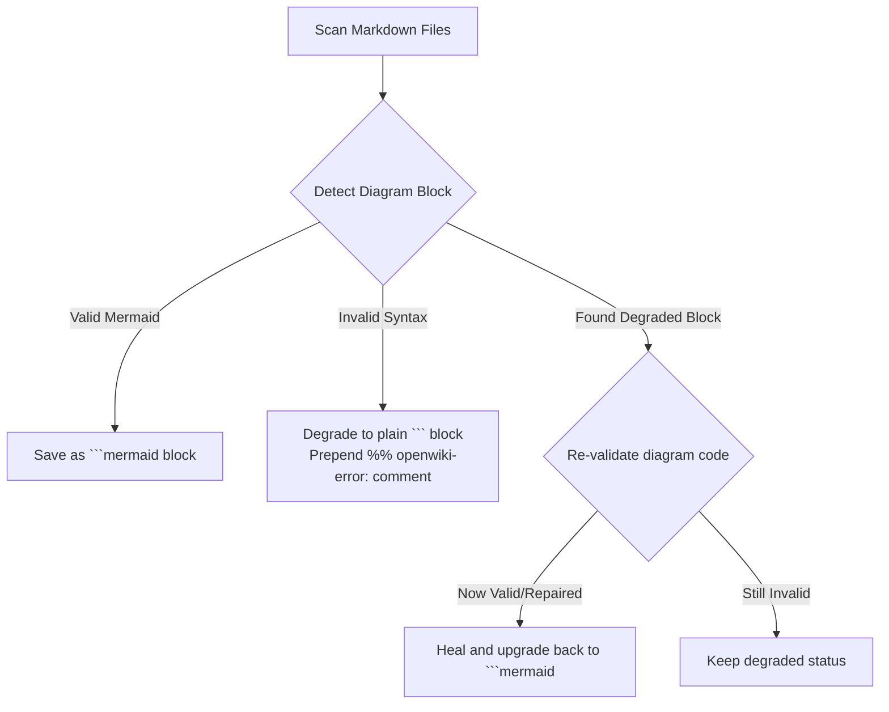

<!-- OPENWIKI:GENERATED BY DSOM PYTHON EMULATOR -->

# OpenWiki Native Python Emulator Instructions

Welcome to the authoritative operational guide for the **OpenWiki Native Python Emulator**. This document details the architectural purpose, interface commands, zero-dependency validation mechanics, and development rules governing the `./openwiki/` documentation ecosystem.

---

## 🏛️ Architectural Purpose

The OpenWiki Native Python Emulator (`tools/openwiki_emulator.py`) satisfies the **Sovereign AI Rule 27 (The Native OpenWiki Emulator & Zero-Binary Mandate)**. It completely replaces heavy, Node.js-based global binaries and external API dependencies with a pure, zero-dependency Python CLI utility.

This ensures:
1. **Digital Sovereignty:** Documentation builds, audits, and visualisations can run entirely offline without calling external cloud APIs or requiring elevated user privileges.
2. **Context Continuity:** Human developers and AI agents share a unified, local knowledge index (`./openwiki/`) mapping directly to physical codebase files.
3. **Execution Safety:** Avoids permission/elevated UAC execution hangs across Linux, macOS, and Windows environments by leveraging the standard python-based `uv run` toolchain.

---

## ⚙️ Operational Commands & Usage

The emulator can be invoked using the standard `uv` execution manager. Here is the full operational interface:

### 1. Initialize & Materialize the Wiki
Creates all planned subdirectories, generates the inventory index skeleton, compiles all planned markdown pages, validates and self-heals any embedded Mermaid diagrams, and exports the standalone graph visualizer.
```bash
uv run --with pyyaml python tools/openwiki_emulator.py --init
```
*(Note: Calling `tools/openwiki_emulator.py` without any arguments defaults to initializing the wiki.)*

### 2. Fast OKF Metadata Search
Searches OKF frontmatter elements (such as `title`, `description`, and `topics`) across all generated wiki pages, returning matching pages with concise summary descriptions instantly.
```bash
uv run --with pyyaml python tools/openwiki_emulator.py --search "ansible"
```

### 3. Compile Recent Git Status
Retrieves current git status, lists porcelain modifications, and compiles updated evidence and documentation blocks before running a full reinitialisation.
```bash
uv run --with pyyaml python tools/openwiki_emulator.py --update
```

### 4. Export Standalone Graph Visualizer
Explicitly regenerates the offline standalone interactive knowledge graph at `./openwiki/graph.html` without recompiling other pages.
```bash
uv run --with pyyaml python tools/openwiki_emulator.py --export-graph
```

---

## 🗂️ Generated OpenWiki Directory Structure

When initialized, the emulator materializes the following physical layout:

```text
openwiki/
├── .last-update.json        # Dynamic metadata tracker (updated timestamps, status, count)
├── INSTRUCTIONS.md          # This instruction document (automatically regenerated)
├── _skeleton.md             # Document inventory, system ranking, and evidence logs
├── graph.html               # Interactive HTML visualizer for the knowledge graph
├── quickstart.md            # Entrypoint navigation and task routing table
├── architecture/
│   └── overview.md          # DSOM scope and the three-pillar operating model
├── governance/
│   └── agent-operation.md   # Dual agent registries and the 27 operational laws
├── memory/
│   └── session-and-palace.md# Session state lifecycle and spatial Palace index
├── automation/
│   ├── ansible-baseline.md  # Inventory tiers and Ansible playbooks
│   └── tools-and-privacy.md # Idempotent bash/powershell wrappers and Privacy Guardian
├── integrations/
│   └── mcp-and-ci.md        # FastMCP server integration and CI pipelines
├── publishing/
│   └── documentation-delivery.md # Multi-channel documentation pipelines (MkDocs, GitBook, RTD)
└── quality/
    └── verification.md      # Regression tests, BOM filters, and cross-platform guardrails
```

---

## 🧜‍♀️ Mermaid Diagram Validation & Self-Healing

The emulator incorporates a zero-dependency Mermaid diagram compiler featuring automated, in-place **self-healing** capabilities.

### Validation Rules Checked:
- **Diagram Type Headers:** Confirms the diagram begins with a valid header (e.g. `flowchart`, `sequenceDiagram`, `stateDiagram-v2`, `erDiagram`).
- **Quote Balancing:** Ensures all unescaped double quotes are perfectly paired across lines.
- **Grouping Characters:** Verifies balanced opening and closing brackets, braces, and parentheses `([{` and `)]}`.
- **ER Diagram Syntax:** Asserts that relationship indicators (e.g. `||--o{`) or entity attribute blocks exist in ER diagrams.
- **Sequence Diagram Syntax:** Validates basic participant declarations, arrows, loop blocks, and alt/else conditions.

### The Self-Healing Mechanism:


1. **In-Place Degradation:** If the validation rules fail for any diagram, the block is safely degraded in-place to a plain code block (preventing static compilation pipelines like MkDocs from throwing errors). It prepends a commented line explaining the exact syntax error:
   ```text
```
%% openwiki-error: Line 2 has mismatched grouping characters: 'A[Start)'
   flowchart TD
       A[Start)
```
   ```
2. **In-Place Self-Healing:** On successive runs of the emulator, if a degraded block is edited and the syntax is corrected, the emulator automatically detects the fix, recovers the block, and upgrades it back into a standard active ` ```mermaid ` block seamlessly.

---

## 🤖 Standard Operating Rules for AI Agents

1. **No Manual Mod-Edit of Wiki Pages:** Do not directly modify the `.md` pages under `./openwiki/` (excluding exceptions explicitly requested by the human operator). All planned pages are compiled from the immutable-safe definitions in `tools/openwiki_emulator.py`.
2. **Modify the Emulator Definition:** If any wiki page needs a text update, new links, or structural adjustments, update its definition inside the `OpenWikiState.get_planned_pages()` mapping inside `tools/openwiki_emulator.py`, then run the `--init` command to compile.
3. **Run Before Committing:** Before finishing any task that changes governance, automation tools, or codebase features, always execute the OpenWiki emulator (`--init` or `--update`) to ensure that all sitemaps, interactive graphs, and documentation pages reflect the latest state of the repository.
