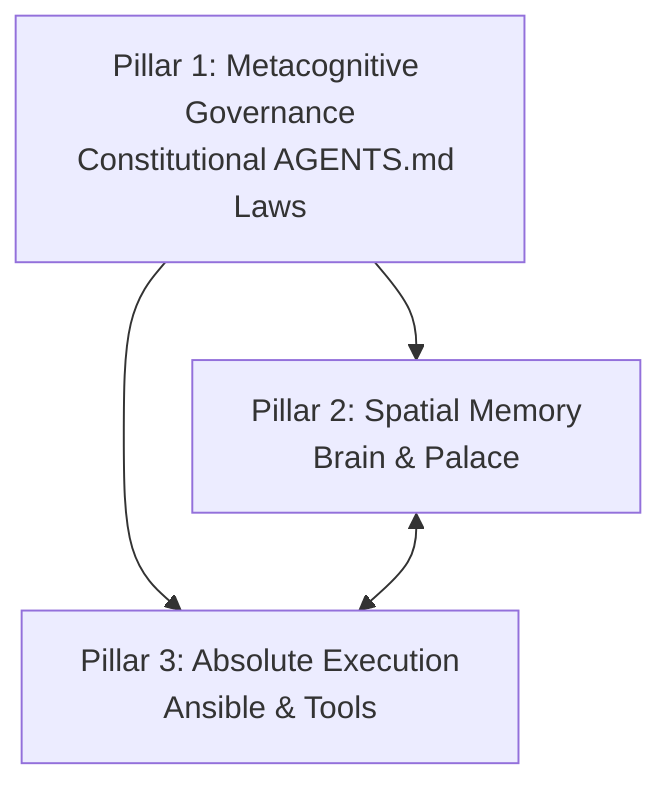

# DSOM Scope & Three-Pillar Operational Model

The **Deep State of Mind (DSOM)** protocol is a metacognitive governance framework designed to establish absolute operational alignment, digital sovereignty, and persistent context continuity between human operators and AI agents.

## 🏛️ The Three-Pillar Operating Model

The architecture of DSOM is structured around three foundational pillars:

1. **Pillar 1: Metacognitive Governance (The Mind):**
   - Established by the master constitution under `.agents/AGENTS.md`.
   - Governs AI self-reflection, behaviour guidelines, token budgeting, and the 27 operational rules.

2. **Pillar 2: Spatial Memory (The Palace):**
   - Co-located in `.agents/brain/` and compiled inside the `docs/` Palace.
   - Prevents context decay across ephemeral chat session boundaries through structured daily reanimation and hibernation rituals.

3. **Pillar 3: Absolute Execution (The Body):**
   - Implemented via declarative automation (Ansible baseline) and idempotent operational wrappers (`tools/`).
   - Ensures that all technical instructions translate directly to deterministic local environment actions.

## 🧱 Component Boundaries & Authoritative Sources

- **Authoritative Source of Truth:** The active repository files and Git history.
- **Cognitive Control Plane:** The `.agents/` folder, which is strictly managed and preserved across sessions.
- **External Public Interfaces:** Render blueprints, Read the Docs configuration, and GitHub Actions CD pipelines.
