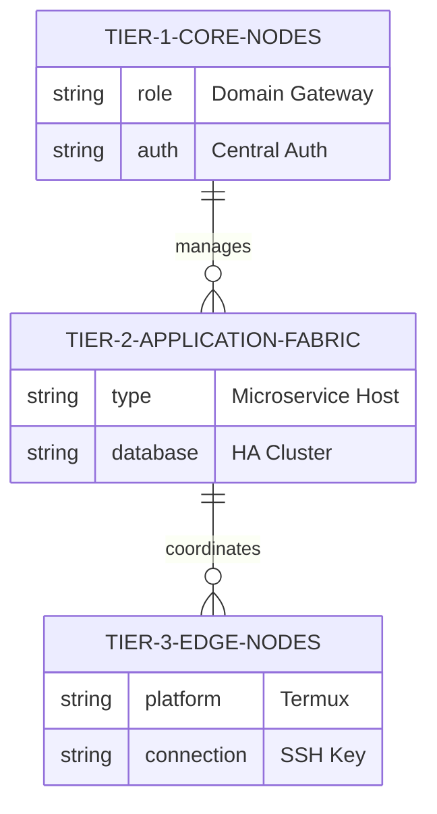

# Ansible Baseline & Automation Fabric Specification

The Execution Pillar of DSOM relies on a declarative and idempotent automation fabric driven by **Ansible**, ensuring all operations are repeatable and zero-binary.

## 🎛️ Inventory Architecture & Tiers

The workspace organises hardware and systems into tiered logical inventories:

- **Tier 1 (Core Nodes):** Domain gateways, central authentication, and DNS/reverse proxies.
- **Tier 2 (Application Fabric):** Microservices, web hosts, database HA clusters, and GIS nodes.
- **Tier 3 (Edge Nodes):** Disconnected or remote edge devices running Termux or local agents.

## 🛠️ Configuration & Core Playbooks

- `ansible.cfg` — Governs custom connection parameters, timeouts, and local roles path mappings.
- `playbooks/preflight.yml` — Runs environmental preflight checks, confirming Python dependencies, OS kernels, and security compliance.
- `playbooks/common.yml` — Sets up baseline system hardening, sovereign SSH keys, and system telemetry agents.

## 💻 WSL2 Control Node Bridge

For Windows 11 environments, DSOM mandates **WSL2 (AlmaLinux 10 / Ubuntu)** as the local Control Node execution bridge, keeping PowerShell scripts as lightweight wrappers that invoke the Linux environment seamlessly.
