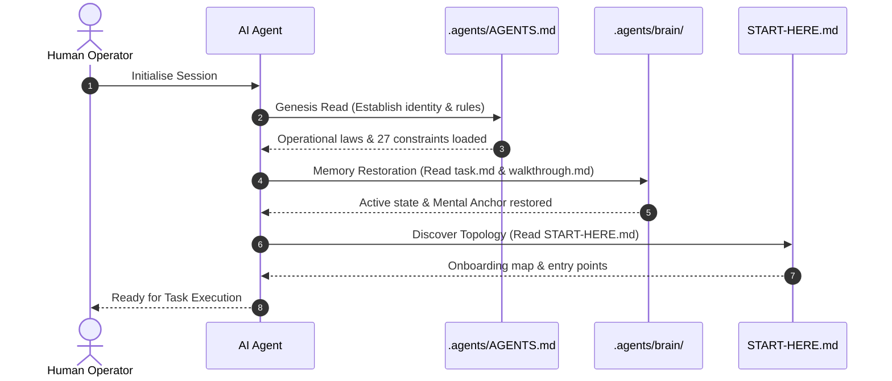

# Dual Agent Registry & Sovereign Operational Laws

To ensure immediate discovery by various platform LLM interfaces, DSOM enforces a dual-layered constitutional registry that anchors the agent's behaviour.

## 📜 The Dual AGENTS.md Registry

1. **The Root Gateway (`AGENTS.md`):**
   - Placed at the workspace root as a discoverable landing page for platform-integrated agents (Copilot, Cursor, etc.).
   - Provides a concise summary of the protocol and redirects agents directly to the full constitution.

2. **The Sovereign Constitution (`.agents/AGENTS.md`):**
   - Located securely within the `.agents/` control directory.
   - Houses the complete 27 operational rules, the Cognitive Twin persona profile (`LinuxMalaysia`), and strict execution constraints.

## ⚙️ The Mechanical Boot Sequence

Upon initialisation or reanimation, the AI agent must strictly follow this sequence before making any workspace changes:

1. **Genesis Read:** Parse `.agents/AGENTS.md` to establish behavioural identity and operational laws.
2. **Memory Restoration:** Parse `.agents/brain/` (including `task.md` and `walkthrough.md`) to restore the exact state of active tasks.
3. **Master Onboarding Map:** Read `START-HERE.md` to understand repository topology and active entry points.

## 🧠 5-Step Local Knowledge-First Discovery Flow

Before running terminal commands or proposing external changes:

1. **Local OKF Search:** Query `topics` and `description` in local frontmatter using `grep_search`.
2. **Targeted Inspection:** Extract and read specific line ranges of relevant files.
3. **Temporal Verification Gate:** Validate the OKF `timestamp` to ensure the information is fresh.
4. **Consensus Request:** Consult the human operator if local documentation is contextually stale.
5. **Physical Execution:** Execute the narrowest possible command to implement verified actions.
