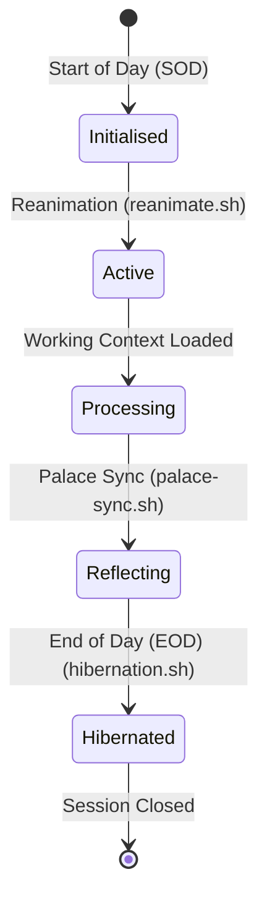

# Session Memory Stratification & Palace Synchronisation

Context decay is the single largest point of failure in Human-AI collaborative engineering. DSOM eliminates this through spatial memory stratification and strict session rituals.

## 🧠 Session State Lifecycle

## 🧠 Spatial Memory & Brain Artifacts

Active state tracking resides within the `.agents/brain/` directory:

- `task.md` — Houses active, pending, and completed tasks.
- `walkthrough.md` — Records session histories and dated Mental Anchors.
- `active_context_manifest.md` — Specifies the exact files currently in active scope.
- `palace_registry.md` — An index of the Sovereign Markdown Palace "rooms" mapping to physical `docs/` files.

## 🌅 Start-of-Day (SOD) Reanimation Ritual

1. The human or system invokes `tools/reanimate.sh` (or `.ps1`).
2. The active context manifest is loaded, instructing the AI to retrieve and populate its working context.
3. The AI reads the dated Mental Anchor in `walkthrough.md` to resume exactly where the previous session left off.

## 🌌 End-of-Day (EOD) Hibernation & Palace Synchronisation

1. The AI maps the session's Git commits to physical Palace rooms.
2. A `palace_update_proposal_*.md` file is generated, outlining recommended knowledge updates.
3. The AI updates the session summary and appends a dated Mental Anchor to `walkthrough.md`.
4. `tools/hibernation.sh` executes preflight checks, stages changes, and cleanly commits them to Git.
